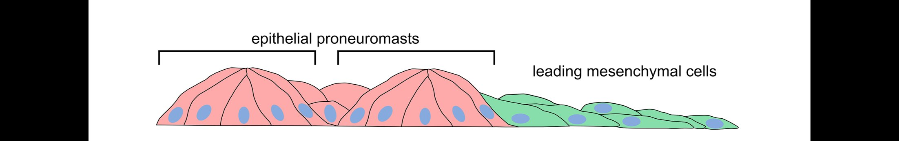
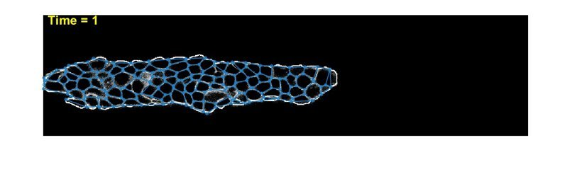
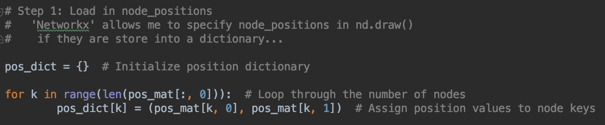
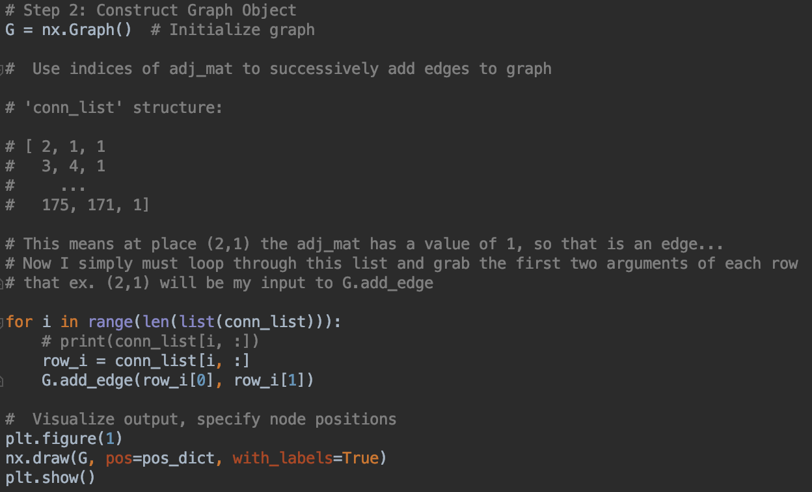
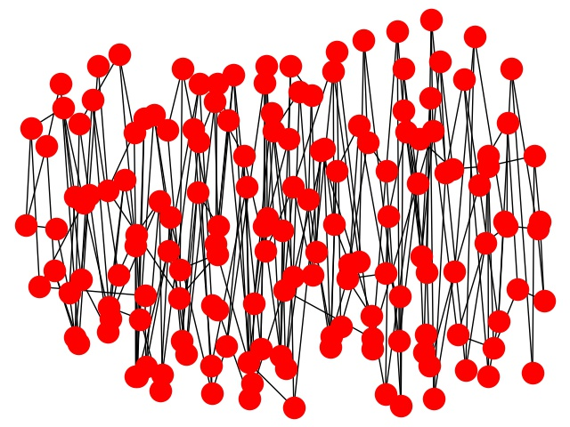
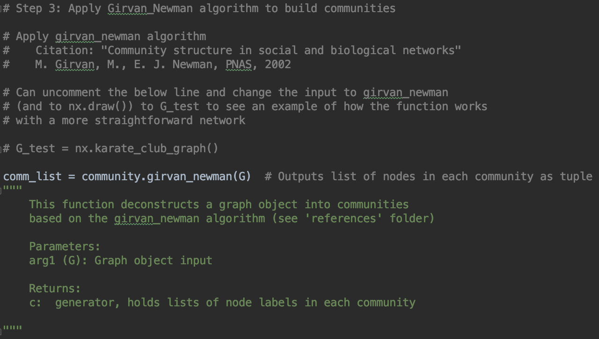

# Motivation

Collective cell migration (CCM) observed in cancer metastasis

Overall goal is to understand the underlying physics of CCM through image analysis and mathematical modeling

Most imaging studies of CCM done in-vitro in cell culture of epithelial cell monolayer. In-vivo would be even better...

Zebrafish act as a model organism to study CCM
   
   1. Cluster of cells called the posterior lateral line primordium (pllp) migrates during early development
   
   2. Transparency allows for easy in-vivo confocal imaging
    
# Zebrafish pllp: Side view schematic
    
  

 
# Previous/Background Work

My lab has taken movies of different phenotypes of the pllp after making various chemical modifications to the system
    (ex. inhibiting FGF, Wnt pathways)
  
I previously wrote code to extract and track vertex/node movement. Thus I have an adjacency matrix and node positions for each time-frame.

1. Single time frame image

# Project Goal
My goal: Use python (networkx specifically) for network analysis of pllp to investigate physical differences between different pllp phenotypes

My first exercise is splitting network into communities based on the Girvin-Newman algorithm 
    
   1. Load in adjacency matrix and node positions from Matlab
    
   2. Construct "Graph" for each time-frame
    
   3. Calculate 'edge-betweenness_centrality'
    
   4. Use that value to build communities based on [https://journals.aps.org/pre/abstract/10.1103/PhysRevE.69.026113]
    
# Girvan-Newman Algorithm to Build Communities

The algorithm's steps for community detection are summarized below:

1.The betweenness of all existing edges in the network is calculated first.

2.The edge with the highest betweenness is removed.

3.The betweenness of all edges affected by the removal is recalculated.

4.Steps 2 and 3 are repeated until no edges remain.

Python makes this easy: girvan_newman(G, most_valuable_edge=None)

However I also wrote my own manual function 'girvan_newman_manual'. 
I am pretty sure that it works correctly but I do not understand 
how to access the output data type.. so who really knows. 

# Step 0: Input files

1. adj_mat.txt

2. node_tracks.txt

    -- node (x,y) positions given by first two columns

# Step 1: Create dictionary to specify node positions

# Step 2: Construct graph object from nonzero adjacency matrix indices

 (current output)

# Step 3: Apply Girvan-Newman algorithm to build communities

# Step 4: Visualize the output
 (current output)

# Next steps: 
-- Adjacency matrix is clearly messed up... look into how I am saving the
   .mat files from matlab to .txt or .xls files. Something is off... 
-- Also need to adjust aspect ratio of output image

# End goal
1. Build communities for each time frame
2. Compile into a movie to examine the dynamics of the communities
    ex. Does a certain part of the pllp always constitute a "community"
        Do the community locations change under different phenotypes?
        Do the communities move/drift throughout the movie?
        
